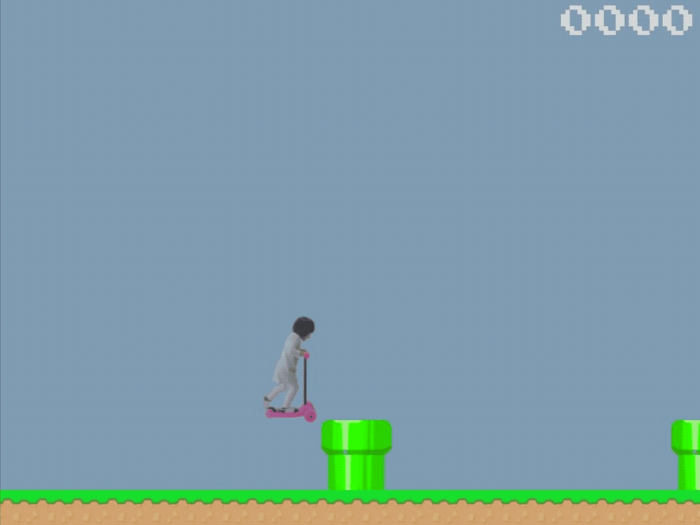

# Mira Jump



### Description
This simple game is modified from Flappy Gopher game from Ebiten. 
It is written in Go using Ebiten library.

Mira is running her scooter. She is going to meet objects on her way, and jumping over them is the only
way to go pass. Every time when she successfully avoids an object she will get one point.

### How to play
Press `space` key or left-click when you want to jump.

### Some modifications that have been made

- Changing Gopher image to Mira image. The new image is stored locally in personal github folder
```shell script
   localsrc "github.com/tracey7d4/mirajump/resources/images
```
- Un-rotating image during jumping period
- Deleting upper pipes
- Increasing gap between two adjacent pipes
- Making pipes' height fixed
- Changing to automatically running on the ground 
- Jumping only once at a time. Another jump can only be done as long as Mira is on the ground.

